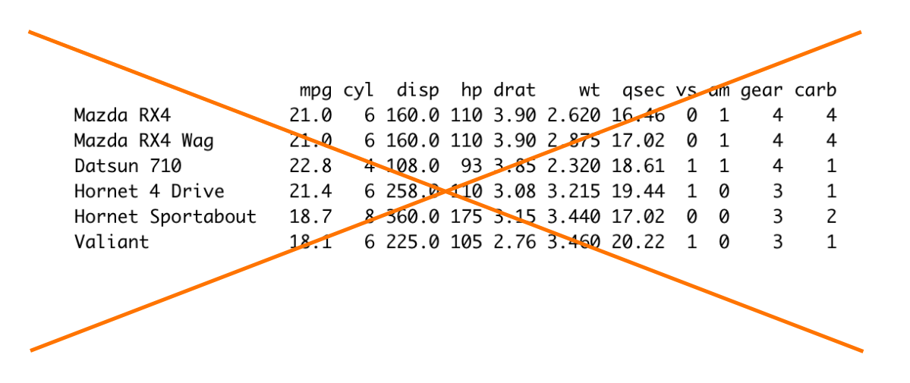
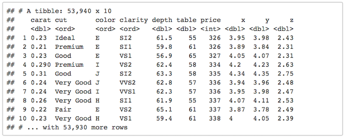
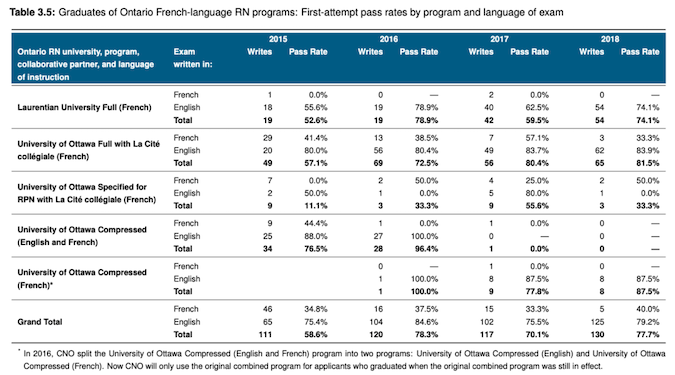
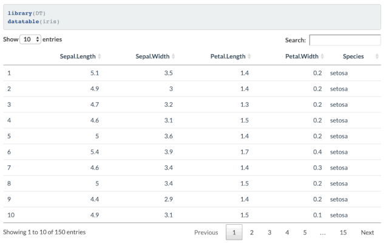
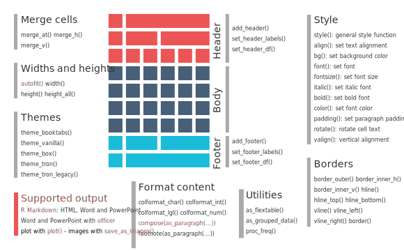
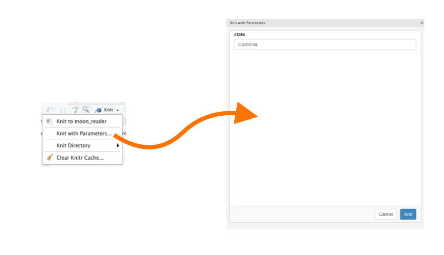
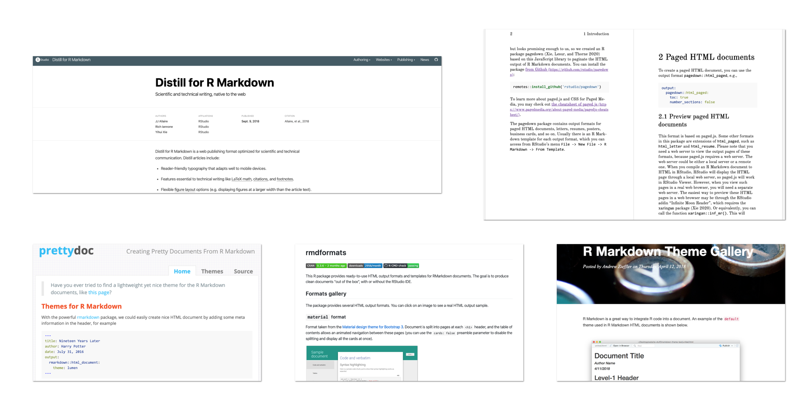
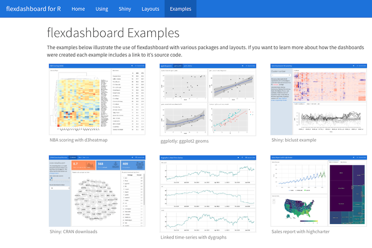
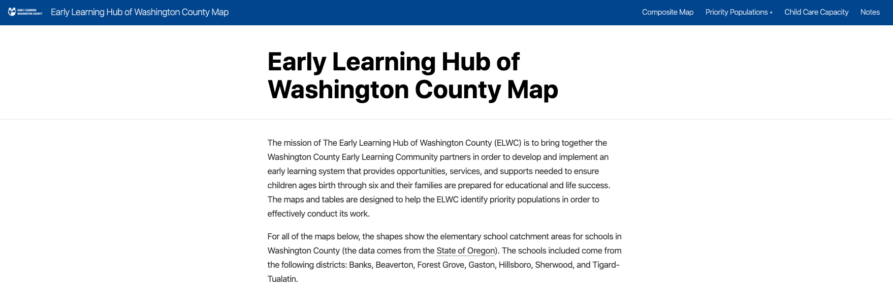
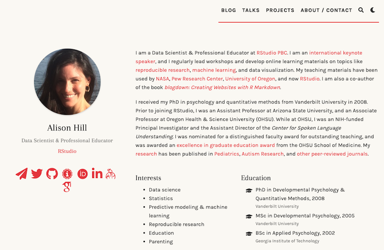

```{r child = "setup.Rmd"}
```

```{r eval = TRUE, echo = FALSE}
library(tidyverse)
library(readxl)
library(janitor)
library(knitr)
```


class: center, middle, inverse

# Advanced Markdown Text Formatting

---

## Links


This is a [link to the Rest for the Rest of Us website](http://rfortherestofus.com/)

--


---

## Images


--

<br>


---

## Block quotes

> Four score and seven years ago our fathers brought forth on this continent, a new nation, conceived in Liberty, and dedicated to the proposition that all men are created equal.

--

<br>


---

## Footnotes

^[This is a footnote]

---
class: center, middle

## `remedy`

```{r out.width = "300px", eval = TRUE, echo = FALSE}
include_graphics("images/remedy-logo.png") 
```


.button[ [Learn more about remedy](https://github.com/ThinkR-open/remedy) ]

---

class: my-turn

## My Turn

I'll do the following:

1. Add a link

1. Add an image

1. Add a block quote

1. Add a footnote

---

---

class: inverse

## Your Turn

Do the following on your report:

1. Add a link

1. Add an image

1. Add a block quote

1. Add a footnote


---

class: center, middle, dk-section-title

background-image:url("images/table.jpg")

# Tables

---

## Don't Use the Default

.center[

]

---

## Data Frame Printing

```{r}
---
title: "Snazzy Report"
output:
  html_document:
    df_print: kable #<<
---
```

--


---

## Data Frame Printing


```{r}
---
title: "Snazzy Report"
output:
  html_document:
    df_print: tibble #<<  
---
```





---

## Data Frame Printing


```{r}
---
title: "Snazzy Report"
output:
  html_document:
    df_print: paged #<<
---
```

--


---

## Table Packages

---

### gt

.center[


.button[ [Learn more about gt](https://gt.rstudio.com/) ]
]

---

### kable + kableExtra

.center[

.small[
Source: [Sharla Gelfand](https://twitter.com/sharlagelfand/status/1192674485792641024)
]
.button[
[Learn more about kableExtra](https://cran.r-project.org/web/packages/kableExtra/vignettes/awesome_table_in_html.html)
]
]

---

### formattable

.center[


.button[ [Learn more about formattable](https://renkun-ken.github.io/formattable/) ]
]

---

### DT

.center[



.button[ [Learn more about DT](https://rstudio.github.io/DT/) ]
]

---

### reactable

.center[


.button[ [Learn more about reactable](https://glin.github.io/reactable/index.html) ]
]

---


### flextable

.center[

```{r  out.width = "60%", eval = TRUE, echo = FALSE}
 
```


.button[ [Learn more about flextable](https://davidgohel.github.io/flextable/) ]
]

---

class: my-turn

## My Turn

I'll do the following:

1. Change the default data frame printing method to use paged tables

1. Demonstrate all of the table packages

---

class: inverse

## Your Turn

Do the following:

1. Change the default data frame printing method to use kable

TK: Update: 1. Choose one of the table packages and make an attractive table with it

---

# Advanced YAML

---


## Table of Contents

```{r}
---
title: "Snazzy Report"
output:
  html_document:
    toc: TRUE #<<
    toc_depth: 2 
    toc_float: TRUE
---
```

---

## Table of Contents

```{r}
---
title: "Snazzy Report"
output:
  html_document:
    toc: TRUE 
    toc_depth: 2 #<<
    toc_float: TRUE
---
```

---

## Table of Contents

```{r}
---
title: "Snazzy Report"
output:
  html_document:
    toc: TRUE
    toc_depth: 2 
    toc_float: TRUE #<<
---
```

--


---

## Figure Options

```{r}
---
title: "Snazzy Report"
output:
  html_document:
    fig_width: 7 #<<
    fig_height: 6
    fig_caption: TRUE
---
```

---

## Figure Options

```{r}
---
title: "Snazzy Report"
output:
  html_document:
    fig_width: 7 
    fig_height: 6 #<<
    fig_caption: TRUE
---
```


---

## Figure Options

```{r}
---
title: "Snazzy Report"
output: 
  html_document:
    fig_width: 7 
    fig_height: 6 
    fig_caption: TRUE #<<
---
```

---

## Figure Options

TK: Note that you can also do this in the setup chunk and/or in individual code chunks

https://twitter.com/xieyihui/status/1232762844980137984

---


## Parameters

```{r}
---
title: "Snazzy Report"
output: html_document
  params:
    state: "California" #<<
---
```

---

## Parameters



???

Learn More

https://medium.com/@urban_institute/iterated-fact-sheets-with-r-markdown-d685eb4eafce

---

class: center, middle

## Additional Options


.pull-left[
[](https://bookdown.org/yihui/rmarkdown/html-document.html)
]

--

.pull-right[
[](https://ymlthis.r-lib.org/)
]


---

class: my-turn

## My Turn

I'll do the following:

1. Add a table of contents

1. Adjust default figure height, width, and captions

1. Knit to make sure everything works

---

class: inverse

## Your Turn

do the following:

1. Add a table of contents and make it floating

1. Adjust default figure height, width, and captions

TK: Update: 1. Add a parameter and make sure it works


---


class: center, middle, dk-section-title

background-image:url("images/inline-skating.jpg")

# Inline R Code

---

## Inline R code

```{r eval = TRUE, echo = FALSE}
california_german_speakers <- read_rds("data/french_and_german_speakers_2019.rds") %>% 
  filter(state == "California") %>% 
  pull(number)
```

These two bits of text look identical, right? 

--


In 2019, there were 854 German speakers in California.

--

In 2019, there were `r california_german_speakers` German speakers in California.


---

## Inline R code

They're not identical!

--

In 2019, there were 854 German speakers in California.

--


---

## Inline R code


---

class: my-turn

## My Turn

I'll do the following:

1. Add a line to my report that uses inline R code

---

class: inverse

## Your Turn

Do the following:

1. Add a line to your report that uses inline R code


---

class: center, middle, dk-section-title

background-image:url("images/microsoft-word.jpg")

# Making your reports look nice: Word edition

---

## Making your reports look nice: Word edition

```{r}
---
title: "Snazzy Report"
output:
    word_document:
      reference_docx: my-word-template.docx
---
```

--

```{r  out.width = "60%", eval = TRUE, echo = FALSE}
include_graphics("images/docx-not-dotx.svg") 
```


---

class: my-turn

## My Turn

I'll do the following:

1. Use a reference document to change the look and feel of my reports that are knitted to Word

---

class: inverse

## Your Turn

Do the following:

1. Use a reference document to change the look and feel of my reports that are knitted to Word

TK: Give them a Word doc to use?


---

## Making your reports shine: HTML edition



???


- https://rstudio.github.io/distill/
- https://github.com/hrbrmstr/markdowntemplates
- https://prettydoc.statr.me/themes.html
- https://github.com/juba/rmdformats
- https://www.datadreaming.org/post/r-markdown-theme-gallery/
- https://pagedown.rbind.io/

If you want to really customize, you need to learn CSS

- https://www.freecodecamp.org/learn/responsive-web-design/basic-css/


---

class: my-turn

## My Turn

I'll do the following:

1. Convert my report to distill format

---

class: inverse

## Your Turn

Do the following:

1. Change the theme of your report by adding a theme option to your YAML. Use any of the following options: “cerulean”, “cosmo”, “flatly”, “journal”, “lumen”, “paper”, “readable”, “sandstone”, “simplex”, “spacelab”, “united”, and “yeti”


---

## Making your reports look nice: PDF edition

.center[
[](https://sctyner.github.io/static/presentations/Conferences/dcr19/slides.html#12)
]

---

## Making your reports look nice: PDF edition

.center[
[](https://twitter.com/jefflittlejohn/status/1216869830726316033)
]

---

## Making your reports look nice: PDF edition

.center[
[](https://twitter.com/andrewheiss/status/1204870408148832257)
]


---

## Making your reports look nice: PDF edition

Use the `chrome_print()` function from `pagedown` to turn any HTML document into a PDF.

```{r}
library(pagedown)

chrome_print("slides.html")
```

---

class: center, middle, dk-section-title-light-bg

background-image:url("images/flexdashboard.png")

# Other Formats

---

## Presentations: Powerpoint


???

https://bookdown.org/yihui/rmarkdown/powerpoint-presentation.html

---

## Presentations: `xaringan`

.center[

]


---


## Dashboards

[](https://rmarkdown.rstudio.com/flexdashboard/examples.html)

---


## Other Formats: bookdown

[](https://howiuser.com/)


---

## Other Formats: Websites

[](https://dgkeyes.github.io/elwc-map/)

---

## Other Formats: Websites

[](https://alison.rbind.io/)

???

Also show https://tinystats.github.io/teacups-giraffes-and-statistics/index.html

---

class: my-turn

## My Turn

I'll do the following:

1. Convert my report to distill format

---

class: inverse

## Your Turn

Render your report into at least one more format. You can try a website if you want, but the other formats are much easier. 


