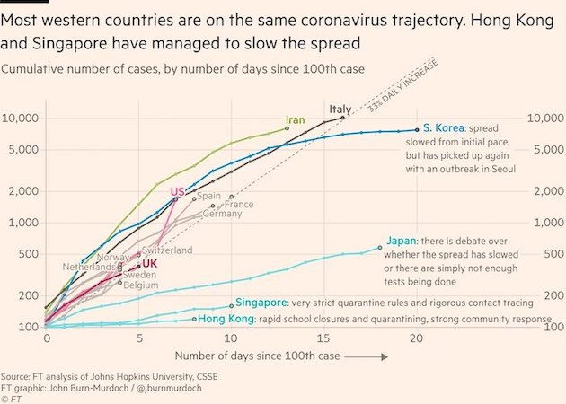
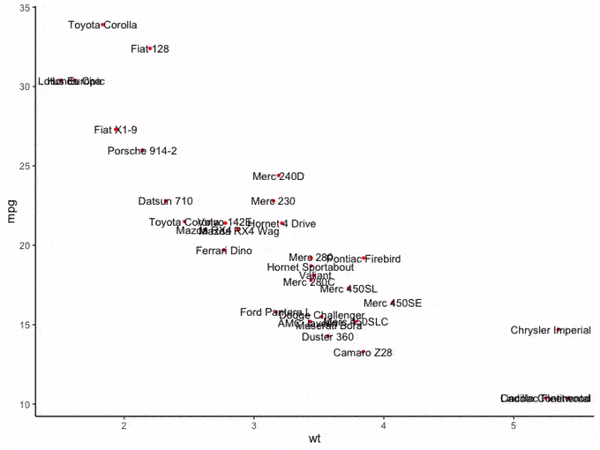
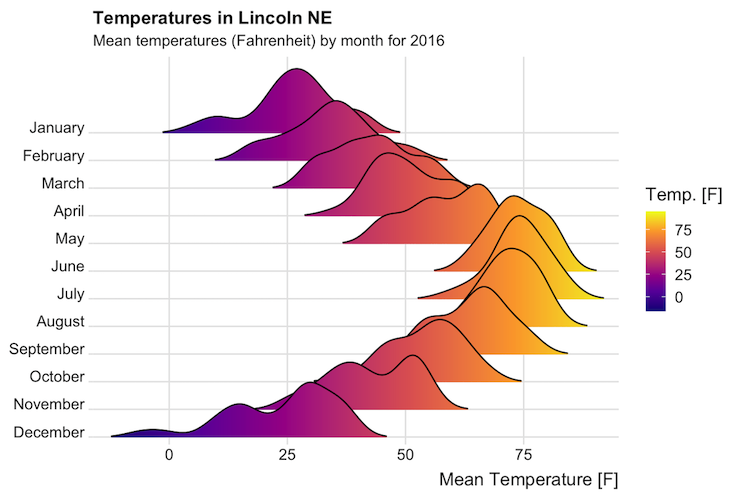
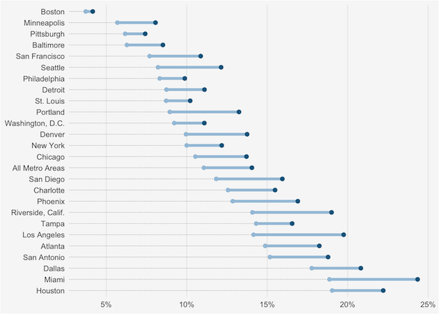
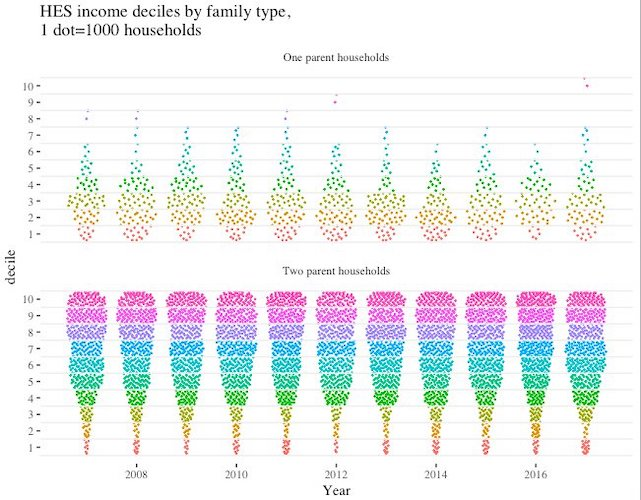
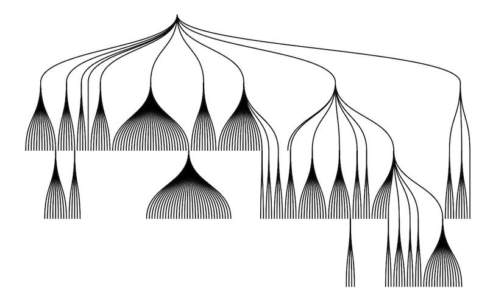
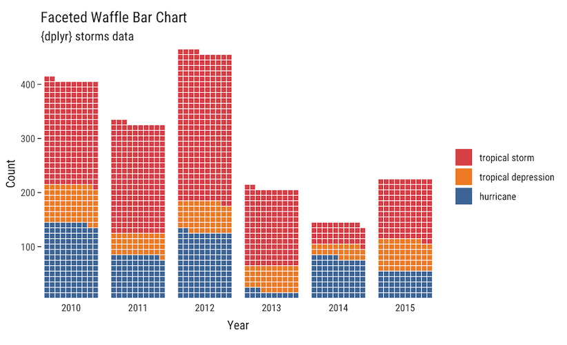
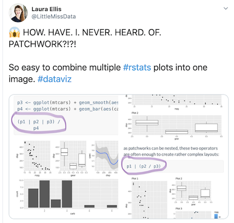

```{r child = "setup.Rmd"}
```

```{r eval = TRUE, echo = FALSE}
library(tidyverse)
library(readxl)
library(janitor)
library(knitr)
```

class: center, middle, dk-section-title

background-image:url("images/jbm-covid-plot.jpeg")

# Best Practices in Data Visualization in R

---

class: center, middle



.small[
Source: [Financial Times, March 11, 2020](https://twitter.com/jburnmurdoch/status/1237737352879112194)
]

---

class: center, middle, dk-section-title

background-image:url("images/highlight.jpg")

## Highlight

---

class: center, middle, dk-section-title

background-image:url("images/declutter.jpg")

## Declutter


---

class: center, middle, dk-section-title

background-image:url("images/explain.jpg")

## Explain


---

class: center, middle, dk-section-title

background-image:url("images/sparkle.jpg")

## Sparkle


---

class: center, middle, dk-section-title

background-image:url("images/highlight.jpg")

# Highlight

---

class: center, middle, dk-section-title

background-image:url("images/pipes.jpg")

## Pipe Data Into ggplot

---

### Load Data

```{r eval = TRUE, echo = FALSE}
third_grade_math_proficiency <- read_rds("../data/third_grade_math_proficiency.rds")
```

--

```{r eval = FALSE}
third_grade_math_proficiency <- read_rds("data/third_grade_math_proficiency.rds")
```

--

```{r eval = TRUE, include = TRUE}
third_grade_math_proficiency
```

---

### Pipe Data Into ggplot

```{r pipe_data}
third_grade_math_proficiency %>% 
  filter(district == "Baker SD 5J") %>% 
  filter(year == "2018-2019")
```

--

```{r ref.label = "pipe_data", echo = FALSE, include = TRUE, eval = TRUE}
```

---

### Pipe Data Into ggplot

```{r pipe_data_into_ggplot}
third_grade_math_proficiency %>% 
  filter(year == "2018-2019") %>% 
  filter(district == "Portland SD 1J") %>% 
  ggplot(aes(x = school, y = percent_proficient)) + #<<
  geom_col() + #<<
  coord_flip()
```

---

### Pipe Data Into ggplot

```{r fig.height = 5, fig.width = 11, ref.label = "pipe_data_into_ggplot", echo = FALSE, include = TRUE, eval = TRUE}
```


---

class: inverse

### Your Turn

1. Create a new RMarkdown document

--

1. Create a data frame called `enrollment_by_race_ethnicity` by reading in your race/ethnicity data from the data wrangling and analysis section using the `read_rds()` function

--

1. Pipe your data into a bar chart that shows the breakdown of race/ethnicity among students in Beaverton SD 48J in 2018-2019


???


```{r eval = TRUE}
enrollment_by_race_ethnicity <- read_rds("../data/enrollment_by_race_ethnicity.rds")
```


---

class: center, middle, dk-section-title

background-image:url("images/goya-cans.jpg")


## Reorder Plots to Highlight Findings

---

### Reorder Plots to Highlight Findings

```{r reorder_plots_v1}
third_grade_math_proficiency %>% 
  filter(year == "2018-2019") %>% 
  filter(district == "Portland SD 1J") %>% 
  ggplot(aes(x = reorder(school, percent_proficient), #<<
             y = percent_proficient)) +
  geom_col() +
  coord_flip() 
```

???

Example: https://yougov.co.uk/topics/politics/articles-reports/2020/04/09/covid-19-healthcare-workers-fear-policies-risk-inf

---

### Reorder Plots to Highlight Findings

```{r fig.height = 5, fig.width = 11, ref.label = "reorder_plots_v1", echo = FALSE, include = TRUE, eval = TRUE}
```

---

### Reorder Plots to Highlight Findings

```{r reorder_plots_v2}
third_grade_math_proficiency %>% 
  filter(year == "2018-2019") %>% 
  filter(district == "Portland SD 1J") %>% 
  mutate(school = fct_reorder(school, percent_proficient)) %>% #<<
  ggplot(aes(x = school, 
             y = percent_proficient)) +
  geom_col() +
  coord_flip() 
```

---

### Reorder Plots to Highlight Findings

```{r fig.height = 5, fig.width = 11, ref.label = "reorder_plots_v2", echo = FALSE, include = TRUE, eval = TRUE}
```


---

class: inverse

### Your Turn

Make a bar chart that shows race/ethnicity in Beaverton SD 48J. As before, filter your data to only include 2018-2019 data and only include Beaverton SD 48J. Then, do the following:

--

1. Using the `reorder()` function, make a bar chart that shows the percent of race/ethnicity groups in descending order

--

1. Make the same bar chart using `mutate()` and `fct_reorder()` to reorder the race/ethnicity groups

???

```{r}
enrollment_by_race_ethnicity %>% 
  filter(year == "2018-2019") %>% 
  filter(district == "Beaverton SD 48J") %>% 
  mutate(race_ethnicity = fct_reorder(race_ethnicity, percent_of_total_enrollment)) %>% 
  ggplot(aes(percent_of_total_enrollment, race_ethnicity)) +
  geom_col()
```


---

class: center, middle, dk-section-title

background-image:url("images/lines.jpg")

## Line Charts

---


### Line Charts

```{r points_only}
third_grade_math_proficiency %>% 
  filter(district == "Portland SD 1J") %>% 
  ggplot(aes(x = year, y = percent_proficient)) + #<<
  geom_line() #<<
```

---

### Line Charts

```{r fig.height = 5, fig.width = 11, ref.label = "points_only", echo = FALSE, include = TRUE, eval = TRUE}
```

---

### Line Charts

```{r first_line_chart}
third_grade_math_proficiency %>% 
  filter(district == "Portland SD 1J") %>% 
  ggplot(aes(x = year, y = percent_proficient,
             group = school)) + #<<
  geom_line()
```

---

### Line Charts

```{r fig.height = 5, fig.width = 11, ref.label = "first_line_chart", echo = FALSE, include = TRUE, eval = TRUE}
```


---

class: center, middle


.small[
Source: [Financial Times, March 11, 2020](https://twitter.com/jburnmurdoch/status/1237737352879112194)
]


---

class: inverse

### Your Turn

1. Make a line chart that shows the growth in the Hispanic/Latino population in school districts from 2017-2018 to 2018-2019


???

```{r}
enrollment_by_race_ethnicity %>% 
  filter(race_ethnicity == "Hispanic/Latino") %>% 
  ggplot(aes(year, percent_of_total_enrollment,
             group = district)) +
  geom_line()
```


---

class: center, middle, dk-section-title

background-image:url("images/color.jpg")

## Use Color to Highlight Findings

---

### Use Color to Highlight Findings

```{r eval = TRUE}
highlight_school <- third_grade_math_proficiency %>% 
  filter(school == "Vestal Elementary School")
```

--

```{r eval = TRUE, include = TRUE}
highlight_school
```


---

### Use Color to Highlight Findings

```{r highlight_with_color}
rru_orange <- "#FF7400"
rru_gray <- "#C3C3C3"

third_grade_math_proficiency %>% 
  filter(district == "Portland SD 1J") %>% 
  ggplot(aes(x = year, y = percent_proficient,
             group = school)) +
  geom_line(color = rru_gray) + #<<
  geom_line(data = highlight_school, #<<
            inherit.aes = TRUE, #<<
            color = rru_orange) #<<
```

---

### Use Color to Highlight Findings

```{r fig.height = 5, fig.width = 11, ref.label = "highlight_with_color", echo = FALSE, include = TRUE, eval = TRUE}
```


---

class: inverse

### Your Turn

1. Identify one school district that has had a lot of growth in its Hispanic/Latino population from 2017-2018 to 2018-2019

--

1. Create a new data frame called `highlight_district` and only include this school in it

--

1. Use the `highlight_district` data frame to create a new `geom_line()` layer on top of the other data 

--

1. Make sure this new layer is a bright color and all other layers are some type of light gray

???

```{r eval = TRUE}
highlight_district <- enrollment_by_race_ethnicity %>% 
  filter(district == "Douglas ESD") %>% 
  filter(race_ethnicity == "Hispanic/Latino")

enrollment_by_race_ethnicity %>% 
  filter(race_ethnicity == "Hispanic/Latino") %>% 
  ggplot(aes(year, percent_of_total_enrollment,
             group = district)) +
  geom_line(color = "gray", alpha = 0.5) +
  geom_line(data = highlight_district,
            inherit.aes = TRUE,
            color = "red")
```


---

class: center, middle, dk-section-title

background-image:url("images/declutter.jpg")

# Declutter


---

## Remove Axis Titles

```{r remove_axis_titles}
third_grade_math_proficiency %>% 
  filter(district == "Portland SD 1J") %>% 
  ggplot(aes(x = year, y = percent_proficient,
             group = school)) +
  geom_line(color = rru_gray) + 
  geom_line(data = highlight_school, 
            inherit.aes = TRUE,
            color = rru_orange) +
  theme_minimal() + #<<
  theme(axis.title = element_blank()) #<<
```


---

## Remove Axis Titles

```{r fig.height = 5, fig.width = 11, ref.label = "remove_axis_titles", echo = FALSE, include = TRUE, eval = TRUE}
```


---

## Remove or Minimize Grid Lines

```{r remove_minor_grid_lines}
third_grade_math_proficiency %>% 
  filter(district == "Portland SD 1J") %>% 
  ggplot(aes(x = year, y = percent_proficient,
             group = school)) +
  geom_line(color = rru_gray) + 
  geom_line(data = highlight_school, 
            inherit.aes = TRUE,
            color = rru_orange) +
  theme_minimal() +
  theme(axis.title = element_blank(),
        panel.grid.minor = element_blank()) #<<
```


---

## Remove or Minimize Grid Lines

```{r fig.height = 5, fig.width = 11, ref.label = "remove_minor_grid_lines", echo = FALSE, include = TRUE, eval = TRUE}
```


---

## Work with Existing Themes

```{r hrbrthemes_example}
library(hrbrthemes)

third_grade_math_proficiency %>% 
  filter(district == "Portland SD 1J") %>% 
  ggplot(aes(x = year, y = percent_proficient,
             group = school)) +
  geom_line(color = rru_gray) + 
  geom_line(data = highlight_school, 
            inherit.aes = TRUE,
            color = rru_orange) +
  theme_ipsum(axis_title_size = 0) + #<<
  theme(panel.grid.minor = element_blank())
```

---

## Work with Existing Themes

```{r fig.height = 5, fig.width = 11, ref.label = "hrbrthemes_example", echo = FALSE, include = TRUE, eval = TRUE}
```

???

- Link to themes RRU blog post: https://rfortherestofus.com/2019/08/themes-to-improve-your-ggplot-figures/
- https://github.com/jmcastagnetto/ggplot2_themes_in_github/


---

class: inverse

## Your Turn

Use some combination of:

--

- Themes — e.g. `theme_minimal()` or `theme_ipsum()` from `hrbrthemes`

--

- The `theme()` function

--

Do the following:

--

1. Remove axis titles 

--

1. Remove or minimize grid lines 

???

```{r}
enrollment_by_race_ethnicity %>% 
  filter(race_ethnicity == "Hispanic/Latino") %>% 
  ggplot(aes(year, percent_of_total_enrollment,
             group = district)) +
  geom_line(color = "gray", alpha = 0.5) +
  geom_line(data = highlight_district,
            inherit.aes = TRUE,
            color = "red")
```


---

class: center, middle, dk-section-title

background-image:url("images/explain.jpg")

# Explain

---

class: center, middle


---

class: center, middle, dk-section-title

background-image:url("images/scales.jpg")

## Use the `scales` Package for Nicely Formatted Values

---

### `scales`

```{r eval = TRUE}
library(scales)

highlight_school <- third_grade_math_proficiency %>% 
  filter(school == "Vestal Elementary School") %>% 
  mutate(percent_proficient_display = percent(percent_proficient, accuracy = 1))
```

--

```{r include = TRUE, eval = TRUE}
highlight_school
```


---

class: inverse

### Your Turn

1. Make a new variable called `percent_display` that shows the `percent_of_total_enrollment` variable as a nicely formatted percent (rounded to the nearest whole number)

--

1. Make sure you save this as `highlight_district` (i.e. don't just display the result)

???

```{r eval = TRUE}
highlight_district <- highlight_district %>% 
  mutate(percent_display = percent(percent_of_total_enrollment, accuracy = 1))
```


---
class: center, middle, dk-section-title

background-image:url("images/card-catalog.jpg")

## Use Direct Labeling

---


### Use Direct Labeling

```{r direct_labeling}
rru_gray <- "#d9d9d9"

third_grade_math_proficiency %>% 
  filter(district == "Portland SD 1J") %>% 
  ggplot(aes(x = year, y = percent_proficient,
             group = school)) +
  geom_line(color = rru_gray) + 
  geom_line(data = highlight_school, 
            inherit.aes = TRUE,
            color = rru_orange) +
  geom_text(data = highlight_school, #<<
            inherit.aes = TRUE, #<<
            aes(label = percent_proficient_display), #<<
            color = rru_orange, #<<
            nudge_x = c(-0.06, 0.06)) + #<<
  theme_ipsum(axis_title_size = 0) + 
  theme(axis.title = element_blank(),
        panel.grid.minor = element_blank())
```

---

### Use Direct Labeling

```{r fig.height = 5, fig.width = 11, ref.label = "direct_labeling", echo = FALSE, include = TRUE, eval = TRUE}
```

---

### Use Direct Labeling

```{r eval = TRUE}
highlight_school <- third_grade_math_proficiency %>% 
  filter(school == "Vestal Elementary School") %>% 
  mutate(percent_proficient_display = percent(percent_proficient, accuracy = 1)) %>% 
  mutate(percent_proficient_display = case_when( #<<
    year == "2018-2019" ~ str_glue("{percent_proficient_display} of students are proficient"), #<<
    TRUE ~ percent_proficient_display #<<
  ))
```

---

### Use Direct Labeling

```{r direct_labeling_again}
third_grade_math_proficiency %>% 
  filter(district == "Portland SD 1J") %>% 
  ggplot(aes(x = year, y = percent_proficient,
             group = school)) +
  geom_line(color = rru_gray) + 
  geom_line(data = highlight_school, 
            inherit.aes = TRUE,
            color = rru_orange) +
  geom_text(data = highlight_school, 
            inherit.aes = TRUE, 
            aes(label = percent_proficient_display),
            color = rru_orange, 
            hjust = c(1.05, -0.05)) + 
  theme_ipsum(axis_title_size = 0) + 
  theme(axis.title = element_blank(),
        panel.grid.minor = element_blank())
```

---

### Use Direct Labeling

```{r fig.height = 5, fig.width = 11, ref.label = "direct_labeling_again", echo = FALSE, include = TRUE, eval = TRUE}
```


---

class: inverse

### Your Turn

Add text to display the percentage of Hispanic/Latino students in Douglas ESD in 2017-2018 and 2018-2019

???

```{r}
enrollment_by_race_ethnicity %>% 
  filter(race_ethnicity == "Hispanic/Latino") %>% 
  ggplot(aes(year, percent_of_total_enrollment,
             group = district)) +
  geom_line(color = "gray", alpha = 0.5) +
  geom_line(data = highlight_district,
            inherit.aes = TRUE,
            color = "red") +
  geom_text(data = highlight_district, 
            inherit.aes = TRUE, 
            aes(label = percent_display),
            color = "red", 
            hjust = c(1.05, -0.05))  + 
  theme_ipsum(axis_title_size = 0) + 
  theme(axis.title = element_blank(),
        panel.grid.minor = element_blank())
```

---

class: center, middle, dk-section-title

background-image:url("images/wise.jpg")

## Use Axis Text Wisely


---

### Use Axis Text Wisely

```{r axis_text_percent}
third_grade_math_proficiency %>% 
  filter(district == "Portland SD 1J") %>% 
  ggplot(aes(x = year, y = percent_proficient,
             group = school)) +
  geom_line(color = rru_gray) + 
  geom_line(data = highlight_school, 
            inherit.aes = TRUE,
            color = rru_orange) +
  geom_text(data = highlight_school, 
            inherit.aes = TRUE, 
            aes(label = percent_proficient_display),
            color = rru_orange, 
            hjust = c(1.05, -0.05)) + 
  scale_y_continuous(labels = percent_format(accuracy = 1)) + #<<
  theme_ipsum(axis_title_size = 0) + 
  theme(axis.title = element_blank(),
        panel.grid.minor = element_blank())
```

---

### Use Axis Text Wisely

```{r fig.height = 5, fig.width = 11, ref.label = "axis_text_percent", echo = FALSE, include = TRUE, eval = TRUE}
```


---

class: inverse

### Your Turn

Make your y axis labels show up as nicely formatted percents using the `percent_format()` function.

???

```{r}
enrollment_by_race_ethnicity %>% 
  filter(race_ethnicity == "Hispanic/Latino") %>% 
  ggplot(aes(year, percent_of_total_enrollment,
             group = district)) +
  geom_line(color = "gray", alpha = 0.5) +
  geom_line(data = highlight_district,
            inherit.aes = TRUE,
            color = "red") +
  geom_text(data = highlight_district, 
            inherit.aes = TRUE, 
            aes(label = percent_display),
            color = "red", 
            hjust = c(1.05, -0.05))  + 
  theme_ipsum(axis_title_size = 0) + 
  theme(axis.title = element_blank(),
        panel.grid.minor = element_blank()) +
  scale_y_continuous(labels = percent_format())
```

---

class: center, middle, dk-section-title

background-image:url("images/coronavirus-billboard.jpg")


## Use Titles to Highlight Findings

---

### Use Titles to Highlight Findings

```{r title_no_color}
third_grade_math_proficiency %>% 
  filter(district == "Portland SD 1J") %>% 
  ggplot(aes(x = year, y = percent_proficient,
             group = school)) +
  geom_line(color = rru_gray) + 
  geom_line(data = highlight_school, 
            inherit.aes = TRUE,
            color = rru_orange) +
  geom_text(data = highlight_school, 
            inherit.aes = TRUE,
            aes(label = percent_proficient_display), 
            color = rru_orange,
            hjust = c(1.05, -0.05)) + 
  scale_y_continuous(labels = percent_format(accuracy = 1)) + 
  labs(title = "Vestal Elementary School showed large gains in\nthird grade math proficiency scores from 2017-2018 to 2018-2019") + #<<
  theme_ipsum(axis_title_size = 0) + 
  theme(axis.title = element_blank(),
        panel.grid.minor = element_blank())
```


---


### Use Titles to Highlight Findings

```{r fig.height = 5, fig.width = 11, ref.label = "title_no_color", echo = FALSE, include = TRUE, eval = TRUE}
```


---

class: inverse

### Your Turn

Add a title to highlight your main finding

???

```{r}
enrollment_by_race_ethnicity %>% 
  filter(race_ethnicity == "Hispanic/Latino") %>% 
  ggplot(aes(year, percent_of_total_enrollment,
             group = district)) +
  geom_line(color = "gray", alpha = 0.5) +
  geom_line(data = highlight_district,
            inherit.aes = TRUE,
            color = "red") +
  geom_text(data = highlight_district, 
            inherit.aes = TRUE, 
            aes(label = percent_display),
            color = "red", 
            hjust = c(1.05, -0.05))  + 
  theme_ipsum(axis_title_size = 0) + 
  theme(axis.title = element_blank(),
        panel.grid.minor = element_blank()) +
  scale_y_continuous(labels = percent_format()) +
  labs(title = "Douglas ESD saw a steep increase in its\nLatino student population in the last two years")
```

---

class: center, middle, dk-section-title

background-image:url("images/colors.jpg")

## Use Color in Titles to Highlight Findings

---

### Use Color in Titles to Highlight Findings

```{r title_with_color}
library(ggtext)

third_grade_math_proficiency %>% 
  filter(district == "Portland SD 1J") %>% 
  ggplot(aes(x = year, y = percent_proficient,
             group = school)) +
  geom_line(color = rru_gray) + 
  geom_line(data = highlight_school, 
            inherit.aes = TRUE,
            color = rru_orange) +
  geom_text(data = highlight_school, 
            inherit.aes = TRUE,
            aes(label = percent_proficient_display), 
            color = rru_orange,
            hjust = c(1.05, -0.05)) + 
  scale_y_continuous(labels = percent_format(accuracy = 1)) + 
  labs(title = "<span style = 'color: #FF7400;'>Vestal Elementary School</span> showed large gains in<br>third grade math proficiency scores from 2017-2018 to 2018-2019") + #<<
  theme_ipsum(axis_title_size = 0) + 
  theme(axis.title = element_blank(),
        panel.grid.minor = element_blank(),
        plot.title = element_markdown()) #<<
```


---


### Use Color in Titles to Highlight Findings

```{r fig.height = 5, fig.width = 11, ref.label = "title_with_color", echo = FALSE, include = TRUE, eval = TRUE}
```


---

class: inverse

### Your Turn

Use color in your title to highlight your main finding. You'll need to:

--

1. Add HTML in the `labs()` function to add the title

--

1. Change the `plot.title` argument in the `theme()` function so that it interprets the HTML correctly

???

```{r}
enrollment_by_race_ethnicity %>% 
  filter(race_ethnicity == "Hispanic/Latino") %>% 
  ggplot(aes(year, percent_of_total_enrollment,
             group = district)) +
  geom_line(color = "gray", alpha = 0.5) +
  geom_line(data = highlight_district,
            inherit.aes = TRUE,
            color = "red") +
  geom_text(data = highlight_district, 
            inherit.aes = TRUE, 
            aes(label = percent_display),
            color = "red", 
            hjust = c(1.05, -0.05))  + 
  labs(title = "<span style = 'color: red;'>Douglas ESD</span> saw a steep increase in its<br>Latino student population in the last two years") +
  theme_ipsum(axis_title_size = 0) + 
  theme(axis.title = element_blank(),
        plot.title = element_markdown(),
        panel.grid.minor = element_blank()) +
  scale_y_continuous(labels = percent_format())
```

---

class: center, middle, dk-section-title

background-image:url("images/ft-annotation-example.jpeg")

## Use Annotations to Explain

---

### Use Annotations to Explain

.small[
```{r annotations_example}
third_grade_math_proficiency %>% 
  filter(district == "Portland SD 1J") %>% 
  ggplot(aes(x = year, y = percent_proficient,
             group = school)) +
  geom_line(color = rru_gray) + 
  geom_line(data = highlight_school, 
            inherit.aes = TRUE,
            color = rru_orange) +
  geom_text(data = highlight_school, 
            inherit.aes = TRUE,
            aes(label = percent_proficient_display), 
            color = rru_orange,
            hjust = c(1.05, -0.05)) + 
  scale_y_continuous(labels = percent_format(accuracy = 1)) + 
  labs(title = "<span style = 'color: #FF7400;'>Vestal Elementary School</span> showed large gains in<br>third grade math proficiency scores from 2017-2018 to 2018-2019") +
  annotate("text", #<<
           x = 2.02, #<<
           y = 0.4, #<<
           label = "Gray lines show other\nPortland Public Schools\nfor comparison", #<<
           hjust = 0, #<<
           size = 3, #<<
           color = "#A0A0A0") + #<<
  theme_ipsum(axis_title_size = 0) +
  theme(axis.title = element_blank(),
        panel.grid.minor = element_blank(),
        plot.title = element_markdown()) 
```
]


???
http://www.thefunctionalart.com/2020/01/an-example-of-how-to-annotate.html

---

### Use Annotations to Explain

```{r fig.height = 5, fig.width = 11, ref.label = "annotations_example", echo = FALSE, include = TRUE, eval = TRUE}
```

???

https://github.com/MattCowgill/ggannotate

---

class: inverse

### Your Turn

Add an annotation somewhere on your chart to help the reader understand it better

???

```{r}
enrollment_by_race_ethnicity %>% 
  filter(race_ethnicity == "Hispanic/Latino") %>% 
  ggplot(aes(year, percent_of_total_enrollment,
             group = district)) +
  geom_line(color = "gray", alpha = 0.5) +
  geom_line(data = highlight_district,
            inherit.aes = TRUE,
            color = "red") +
  geom_text(data = highlight_district, 
            inherit.aes = TRUE, 
            aes(label = percent_display),
            color = "red", 
            hjust = c(1.05, -0.05))  + 
  labs(title = "<span style = 'color: red;'>Douglas ESD</span> saw a steep increase in its<br>Latino student population in the last two years") +
  theme_ipsum(axis_title_size = 0) + 
  theme(axis.title = element_blank(),
        plot.title = element_markdown(),
        panel.grid.minor = element_blank()) +
  scale_y_continuous(labels = percent_format()) +
  annotate("text",
           x = 2.02,
           y = 0.77, 
           label = "Woodburn has the\nhighest percentage\nof any district", #<<
           lineheight = 1,
           hjust = 0,
           size = 3,
           color = "gray")
```

---

class: center, middle, dk-section-title

background-image:url("images/sparkle.jpg")

# Make it Sparkle

---

class: center, middle

## Don't Use Defaults


---

### TK: Something about removing gaps

.small[
```{r remove_gaps}
third_grade_math_proficiency %>% 
  filter(district == "Portland SD 1J") %>% 
  ggplot(aes(x = year, y = percent_proficient,
             group = school)) +
  geom_line(color = rru_gray) + 
  geom_line(data = highlight_school, 
            inherit.aes = TRUE,
            color = rru_orange) +
  geom_text(data = highlight_school, 
            inherit.aes = TRUE,
            aes(label = percent_proficient_display), 
            color = rru_orange,
            hjust = c(1.05, -0.05)) + 
  scale_y_continuous(labels = percent_format(accuracy = 1)) + 
  labs(title = "<span style = 'color: #FF7400;'>Vestal Elementary School</span> showed large gains in<br>third grade math proficiency scores from 2017-2018 to 2018-2019") +
  annotate("text", 
           x = 2.02, 
           y = 0.4, 
           label = "Gray lines show other\nPortland Public Schools\nfor comparison",
           hjust = 0,
           size = 3, 
           color = "#A0A0A0") + 
  theme_ipsum(axis_title_size = 0) +
  theme(axis.title = element_blank(),
        panel.grid.minor = element_blank(),
        plot.title = element_markdown()) +
  scale_x_discrete(expand = expansion(add = c(0.1, 0.5))) #<<

```
]

---

### TK: Something about removing gaps

```{r fig.height = 5, fig.width = 11, ref.label = "remove_gaps", echo = FALSE, include = TRUE, eval = TRUE}
```

---

class: inverse

### Your Turn

TK

???

```{r}
enrollment_by_race_ethnicity %>% 
  filter(race_ethnicity == "Hispanic/Latino") %>% 
  ggplot(aes(year, percent_of_total_enrollment,
             group = district)) +
  geom_line(color = "gray", alpha = 0.5) +
  geom_line(data = highlight_district,
            inherit.aes = TRUE,
            color = "red") +
  geom_text(data = highlight_district, 
            inherit.aes = TRUE, 
            aes(label = percent_display),
            color = "red", 
            hjust = c(1.05, -0.05))  + 
  labs(title = "<span style = 'color: red;'>Douglas ESD</span> saw a steep increase in its<br>Latino student population in the last two years") +
  theme_ipsum(axis_title_size = 0) + 
  theme(axis.title = element_blank(),
        plot.title = element_markdown(),
        panel.grid.minor = element_blank()) +
  scale_y_continuous(labels = percent_format()) +
  annotate("text",
           x = 2.02,
           y = 0.77, 
           label = "Woodburn has the\nhighest percentage\nof any district", #<<
           lineheight = 1,
           hjust = 0,
           size = 3,
           color = "gray")
```

---

class: center, middle, dk-section-title

background-image:url("images/ggpomological.png")

## Customize Your Theme

---

### Make Your Own Custom Theme

```{r eval = TRUE}
theme_dk <- function() {
  theme_ipsum(axis_title_size = 0) +
    theme(axis.title = element_blank(),
          panel.grid.minor = element_blank(),
          plot.title = element_markdown()) 
}
```

---

### Make Your Own Custom Theme

.small[
```{r theme_dk_plot}
enrollment_by_race_ethnicity %>% 
  filter(race_ethnicity == "Hispanic/Latino") %>% 
  ggplot(aes(year, percent_of_total_enrollment,
             group = district)) +
  geom_line(color = "gray", alpha = 0.5) +
  geom_line(data = highlight_district,
            inherit.aes = TRUE,
            color = "red") +
  geom_text(data = highlight_district, 
            inherit.aes = TRUE, 
            aes(label = percent_display),
            color = "red", 
            hjust = c(1.05, -0.05))  + 
  labs(title = "<span style = 'color: red;'>Douglas ESD</span> saw a steep increase in its<br>Latino student population in the last two years") +
  theme_ipsum(axis_title_size = 0) + 
  theme(axis.title = element_blank(),
        plot.title = element_markdown(),
        panel.grid.minor = element_blank()) +
  scale_y_continuous(labels = percent_format()) +
  annotate("text",
           x = 2.02,
           y = 0.77, 
           label = "Woodburn has the\nhighest percentage\nof any district", 
           lineheight = 1,
           hjust = 0,
           size = 3,
           color = "gray") +
  theme_dk() #<<
```
]


---

### Make Your Own Custom Theme


```{r ref.label = "theme_dk_plot", fig.height = 5, fig.width = 11, echo = FALSE, include = TRUE, eval = TRUE}
```

---

class: inverse

### Your Turn

1. Make your own theme by combining elements of the `theme()` function and/or themes from other packages (e.g. `theme_ipsum()`)

--

1. Add this theme to your plot, removing any code that is now redundant

???

```{r}
theme_student <- function() {
  theme_ipsum(axis_title_size = 0) + 
    theme(axis.title = element_blank(),
          plot.title = element_markdown(),
          panel.grid.minor = element_blank())
}

enrollment_by_race_ethnicity %>% 
  filter(race_ethnicity == "Hispanic/Latino") %>% 
  ggplot(aes(year, percent_of_total_enrollment,
             group = district)) +
  geom_line(color = "gray", alpha = 0.5) +
  geom_line(data = highlight_district,
            inherit.aes = TRUE,
            color = "red") +
  geom_text(data = highlight_district, 
            inherit.aes = TRUE, 
            aes(label = percent_display),
            color = "red", 
            hjust = c(1.05, -0.05))  + 
  labs(title = "<span style = 'color: red;'>Douglas ESD</span> saw a steep increase in its<br>Latino student population in the last two years") +
  theme_student() +
  scale_y_continuous(labels = percent_format()) +
  annotate("text",
           x = 2.02,
           y = 0.77, 
           label = "Woodburn has the\nhighest percentage\nof any district", #<<
           lineheight = 1,
           hjust = 0,
           size = 3,
           color = "gray")
```

---

class: center, middle, dk-section-title

background-image:url("images/fonts.jpg")

## Customize Your Fonts

---

### Import Custom Fonts

```{r eval = TRUE, echo = FALSE}
library(extrafont)
```

```{r eval = FALSE}
library(extrafont)

font_import(pattern = "Karla")
```

--

```{r}
fonts()
```

---

### Use Custom Fonts

```{r include = TRUE}
third_grade_math_proficiency %>% 
  filter(district == "Portland SD 1J") %>% 
  slice_max(percent_proficient, n = 3) %>% 
  ggplot(aes(x = percent_proficient, y = school)) +
  geom_col() +
  scale_x_continuous(labels = percent_format(accuracy = 1)) + 
  theme_minimal(base_family = "Karla") #<<
```

---


### Use Custom Fonts

```{r}
third_grade_math_proficiency %>% 
  filter(district == "Portland SD 1J") %>% 
  slice_max(percent_proficient, n = 3) %>% 
  ggplot(aes(x = percent_proficient, y = school)) +
  geom_col() +
  geom_text(aes(label = percent(percent_proficient, accuracy = 1))) +
  scale_x_continuous(labels = percent_format(accuracy = 1)) + 
  theme_minimal(base_family = "Karla") +
  theme(axis.title = element_blank())
```

---

### Use Custom Fonts

```{r}
third_grade_math_proficiency %>% 
  filter(district == "Portland SD 1J") %>% 
  slice_max(percent_proficient, n = 3) %>% 
  ggplot(aes(x = percent_proficient, y = school)) +
  geom_col() +
  geom_text(aes(label = percent(percent_proficient, accuracy = 1)),
            hjust = 1.5,
            color = "white",
            family = "Karla") + #<<
  scale_x_continuous(labels = percent_format(accuracy = 1)) + 
  theme_minimal(base_family = "Karla") +
  theme(axis.title = element_blank())
```

---

### Use Custom Fonts

```{r}
third_grade_math_proficiency %>% 
  filter(district == "Portland SD 1J") %>% 
  slice_max(percent_proficient, n = 3) %>% 
  ggplot(aes(x = percent_proficient, y = school)) +
  geom_col() +
  geom_text(aes(label = percent(percent_proficient, accuracy = 1)),
            hjust = 1.5,
            color = "white",
            family = "Karla") +
  annotate("text", x = 0.5, y = 2, label = "This is an annotation",
           color = "white",
           family = "Karla") + #<<
  scale_x_continuous(labels = percent_format(accuracy = 1)) + 
  theme_minimal(base_family = "Karla") +
  theme(axis.title = element_blank())
```

???

Plotting + saving (i.e. use device = cairo_pdf). Point people to Heiss article below.

https://www.andrewheiss.com/blog/2017/09/27/working-with-r-cairo-graphics-custom-fonts-and-ggplot/

---

class: inverse

### Your Turn

1. Install the `extrafonts` package

--

1. Run the `import_fonts()` function to make all fonts on your computer available in R (it will take a few minutes)

--

1. Change all text to use a custom font (you'll have to do this in a few different places)

???

```{r}
theme_student <- function() {
  theme_ipsum(axis_title_size = 0,
              base_family = "Inter") + 
    theme(axis.title = element_blank(),
          plot.title = element_markdown(family = "Inter"),
          panel.grid.minor = element_blank())
}

enrollment_by_race_ethnicity %>% 
  filter(race_ethnicity == "Hispanic/Latino") %>% 
  ggplot(aes(year, percent_of_total_enrollment,
             group = district)) +
  geom_line(color = "gray", alpha = 0.5) +
  geom_line(data = highlight_district,
            inherit.aes = TRUE,
            color = "red") +
  geom_text(data = highlight_district, 
            inherit.aes = TRUE, 
            family = "Inter",
            aes(label = percent_display),
            color = "red", 
            hjust = c(1.05, -0.05))  + 
  labs(title = "<span style = 'color: red;'>Douglas ESD</span> saw a steep increase in its<br>Latino student population in the last two years") +
  theme_student() +
  scale_y_continuous(labels = percent_format()) +
  annotate("text",
           x = 2.02,
           y = 0.77, 
           label = "Woodburn has the\nhighest percentage\nof any district", #<<
           lineheight = 1,
           family = "Inter",
           hjust = 0,
           size = 3,
           color = "gray")
```

---

class: center, middle, dk-section-title

background-image:url("images/ggridges.png")

## Try New Plot Types

---

### `ggrepel`

--

.center[

]

---

### `gganimate`

--

.center[

]

---

### `ggridges`

--



---

### `ggalt`

--



---

### `ggbeeswarm`

--



---

### `ggraph`

--


(https://ggraph.data-imaginist.com/)

--- 

### `treemapify`


---

### `waffle`




---

### `patchwork`




---

### `shadowtext`


???

TK: Add to end 

https://www.williamrchase.com/slides/assets/player/KeynoteDHTMLPlayer.html
Malcolm Barrett slides
https://www.data-to-viz.com/
https://github.com/erikgahner/awesome-ggplot2
Data Visualization: A practical introduction
Fundamentals of Data Visualization


---

class: inverse

### Your Turn

1. Use one of the packages above to make a unique plot. For example, you might use dumbell plots in the `ggalt` package to show change in the Hispanic/Latino population from 2017-2018 to 2018-2019 for all districts.

--

1. When you finish your plot, email it to me at david@rfortherestofus.com! I'd love to see what you come up with.

