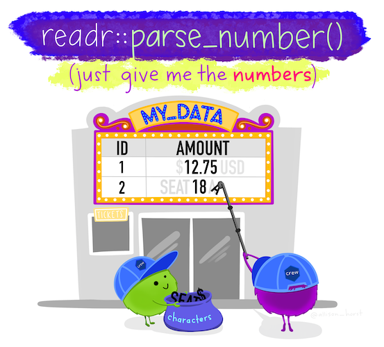
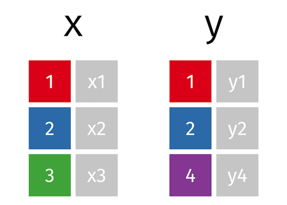
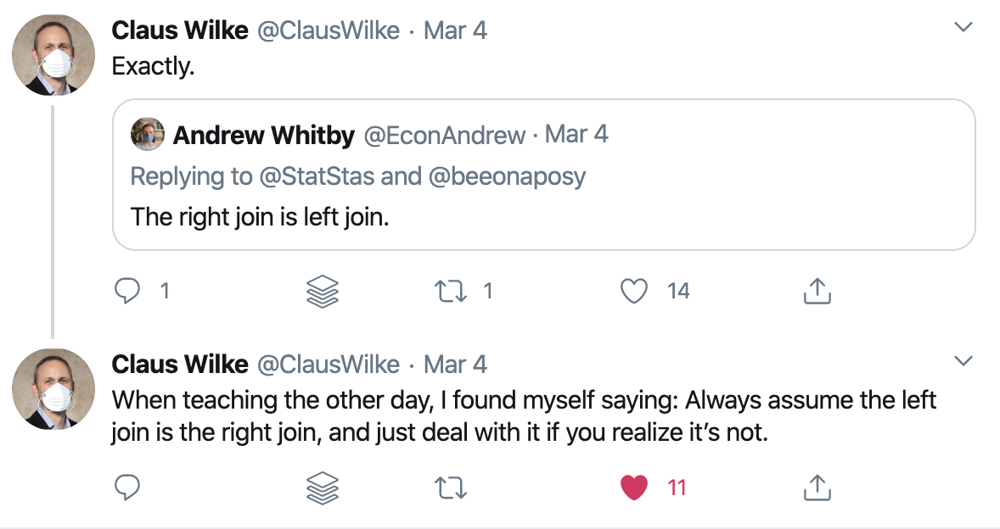

```{r child = "setup.Rmd"}
```

```{r eval = TRUE, echo = FALSE}
library(tidyverse)
library(readxl)
library(janitor)
library(here)
```


class: center, middle, dk-section-title

background-image:url("images/data.jpg")

# Importing Data

---

## Downloading Data Directly

The `download.file()` function lets us download files directly from websites.

```{r eval = FALSE}
download.file(url, destfile = "data-raw/name-of-file.xlsx")
```

???

Benefit = reproducibility

---

## Importing Excel Files

.center[

]

---

## Importing Excel Files

```{r eval = FALSE}
data_frame <- read_excel(path = "directory_name/file_name.xlsx",
                         sheet = "name of sheet")
```

---

## Importing Excel Files


```{r eval = TRUE, echo = FALSE}
german_speakers <- read_excel(path = here("data-raw", "german-and-french-speakers.xlsx"),
                              sheet = "German speakers") %>% 
  clean_names()
```

```{r eval = FALSE}
german_speakers <- read_excel(path = "data-raw/german-and-french-speakers.xlsx",
                              sheet = "German speakers") %>% 
  clean_names()
```

--

```{r eval = TRUE, echo = FALSE}
german_speakers
```


---

## Other Packages for Importing Data

.pull-left[
Got SAS, Stata, or SPSS data? Use the [haven package](https://haven.tidyverse.org/).
]

.pull-right[
.center[

]
]

---

## Other Packages for Importing Data

.pull-left[
The [rio package](https://github.com/leeper/rio) makes it as simple as possible to import and export data. 

You give it the location of the data file in the `import()` function and it auto-detects the file type. 
]

.pull-right[
.center[

]
]

---

class: my-turn

## My Turn

Throughout, I'll be working with [data on third grade math proficiency in Oregon schools](https://www.oregon.gov/ode/educator-resources/assessment/Pages/Assessment-Group-Reports.aspx).

I'll do the following:

--

1. Create a new project

--

1. Create a new R script file where I'll do all of my data cleaning work

--

1. Download math proficiency scores from 2017-2018 and 2018-2019 and put them in a data-raw folder

--

1. Import the two spreadsheets into two data frames (`math_scores_17_18` and `math_scores_18_19`)


---

class: inverse

## Your Turn


You'll be working with data on [Oregon school enrollment by race/ethnicity](https://www.oregon.gov/ode/reports-and-data/students/Pages/Student-Enrollment-Reports.aspx). 

--

1. Create a new project. Make sure you put it somehwere you'll be able to find it again later!

--

1. Download the two files (links below) using the download.file() function into a data-raw folder (which you'll need to create)

--

1. Create a new R script file where you'll do all of your data cleaning work

--

1. Import the two spreadsheets into two data frames (`enrollment_17_18` and `enrollment_18_19`)


---

class: center, middle, dk-section-title

background-image:url("images/berries.jpg")

# Tidy Data

---

class: center, middle


---

## Untidy Data

```{r eval = TRUE, echo = FALSE}
german_speakers_numeric <- read_excel(path = here("data-raw", "german-and-french-speakers.xlsx"),
                              sheet = "German speakers",
                              na = "-") %>% 
  clean_names()
```


```{r echo = FALSE, eval = FALSE}
german_speakers_numeric <- read_excel(path = "data-raw/german-and-french-speakers.xlsx",
                              sheet = "German speakers",
                              na = "-") %>% 
  clean_names()
```

--

```{r eval = TRUE, echo = FALSE}
german_speakers_numeric
```

---

## Untidy Data

--

```{r eval = TRUE}
german_speakers_numeric %>% 
  mutate(total = number_of_german_speakers_2017 + number_of_german_speakers_2018 + number_of_german_speakers_2019) %>% 
  select(state, total)
```

???

But what if we have 10 or 20 years of data? Are we going to write out a all of those years individually?


---

## Tidy Data


```{r eval = TRUE, echo = FALSE}
german_speakers_tidy <- german_speakers_numeric %>% 
  pivot_longer(cols = -state,
               names_to = "year",
               values_to = "number")
```

```{r eval = TRUE, echo = FALSE}
german_speakers_tidy 
```

---

## Tidy Data


```{r eval = TRUE}
german_speakers_tidy %>% 
  group_by(state) %>% 
  summarize(total = sum(number, na.rm = TRUE))
```


???

The tidyverse wants data in a certain format: tidy. With data in this format, it becomes much easier to work with. 

---

## The Three Rules of Tidy Data

--

1. Each variable forms a column.

--

2. Each observation forms a row.

--

3. Each type of observational unit forms a table.

--

*We'll focus on #1 and #3. To read about examples of untidy data, check out the [Tidy Data vignette](https://tidyr.tidyverse.org/articles/tidy-data.html).*

---

class: my-turn

## My Turn

Let's take a look at my data and see which principles of tidy data it violates


---

class: inverse

## Your Turn

--

1. Read the [Tidy Data vignette](https://tidyr.tidyverse.org/articles/tidy-data.html)

--

1. Take a look at your data and see which principles of tidy data it violates

---

class: center, middle, dk-section-title

background-image:url("images/shape.jpg")

# Reshaping Data

---

## Reshaping Data: `pivot_longer()`

The `pivot_longer()` function helps us in situations where **column headers are values, not variable names**.

--

```{r eval = FALSE}
data_frame %>% 
  pivot_longer(cols = columns_to_use) #<<
```

--

```{r eval = FALSE}
data_frame %>% 
  pivot_longer(cols = columns_to_use,
               names_to = "name_of_identifer_variable") #<<
```

--

```{r eval = FALSE}
data_frame %>% 
  pivot_longer(cols = columns_to_use,
               names_to = "name_of_identifer_variable",
               values_to = "name_of_value_variable") #<<
```


---

## Reshaping Data: `pivot_longer()`

```{r eval = TRUE, echo = FALSE}
german_speakers
```

---

## Reshaping Data: `pivot_longer()`

```{r pivot_longer_example}
german_speakers %>% 
  pivot_longer(cols = -state)
```

--

```{r ref.label = "pivot_longer_example", eval = TRUE, echo = FALSE}
```


---

## Reshaping Data: `pivot_longer()`

```{r eval = TRUE}
german_speakers %>% 
  pivot_longer(cols = -state,
               names_to = "year", #<<
               values_to = "number") #<<
```

---

## Reshaping Data: `pivot_wider()`

```{r eval = TRUE}
german_speakers %>% 
  pivot_longer(cols = -state,
               names_to = "year",
               values_to = "number") %>% 
  pivot_wider(id_cols = year, #<<
              names_from = "state", #<<
              values_from = "number") #<<
```

???

I mostly use it to present data in tables

---

class: my-turn

## My Turn

I'll do the following to create a new data frame called `third_grade_math_proficiency_18_19`: 

--

1. Use `filter()` to only keep rows where the `student_group` variable is "Total Population (All Students)"

--

1. Use `filter()` to only keep third grade students

--

1. Use `select()` to only keep variables related to the **number** (not percentage) of students who are proficient in math

--

1. Use `pivot_longer()` to make my data frame tidy

---

class: inverse

## Your Turn

Do the following to create a new data frame called `enrollment_by_race_ethnicity_18_19`: 

--

1. Start with the `enrollment_18_19` data frame

--

1. select() the `district_id` variable as well as those about number of students by race/ethnicity and get rid of all others (hint: use the [`contains()` helper function](https://dplyr.tidyverse.org/reference/select.html#useful-functions) within `select()`)

--

1. Use `pivot_longer()` to convert all of the race/ethnicity variables into one variable

--

1. Within `pivot_longer()`, use the names_to argument to call that variable `race_ethnicity`

--

1. Within `pivot_longer()`, use the values_to argument to call that variable `number_of_students`


---

class: center, middle, dk-section-title

background-image:url("images/missing.jpg")

# Dealing with Missing Data

---

## `na_if()`

```{r eval = TRUE}
german_speakers %>% 
  pivot_longer(cols = -state,
               names_to = "year", 
               values_to = "number")
```

---

## `na_if()`

```{r german_speakers_na_if}
german_speakers %>% 
  pivot_longer(cols = -state,
               names_to = "year", 
               values_to = "number") %>% 
  mutate(number = na_if(number, "-")) #<<
```

---

## `na_if()`

```{r ref.label = "german_speakers_na_if", eval = TRUE, echo = FALSE}
```


???

The `na_if()` function turns values that represent missing data into actual NAs

You can also do this with na arguments in read_excel etc

---

## `replace_na()`


```{r replace_na_example}
german_speakers %>% 
  pivot_longer(cols = -state,
               names_to = "year", 
               values_to = "number") %>% 
  mutate(number = na_if(number, "-")) %>% 
  mutate(number = replace_na(number, 0)) #<<
```

???

The `replace_na()` function does the opposite: turns NAs into values.


---


## `replace_na()`


```{r ref.label = "replace_na_example", eval = TRUE, echo = FALSE}
```

---

class: my-turn

## My Turn

I'll convert all of the missing values in the `number_proficient` variable to NA using `na_if()`

*I don't have any values where using `replace_na()` makes sense, but you'll use it shortly!*

---

class: inverse

## Your Turn

--

1. Convert all of the missing values in the `number_of_students` variable to NA using `na_if()`

--

1. Convert all of the NA values you just made to 0 using `replace_na()`.

---

class: center, middle, dk-section-title

background-image:url("images/types.jpg")

# Changing Variable Types

---

## Changing Variable Types

```{r eval = TRUE, echo = TRUE}
german_speakers %>% 
  pivot_longer(cols = -state,
               names_to = "year", 
               values_to = "number") %>% 
  mutate(number = na_if(number, "-")) %>% 
  mutate(number = replace_na(number, 0))
```

---

## Changing Variable Types

```{r}
german_speakers %>% 
  pivot_longer(cols = -state,
               names_to = "year", 
               values_to = "number") %>% 
  mutate(number = na_if(number, "-")) %>% 
  mutate(number = replace_na(number, 0)) %>% 
  summarize(total = sum(number)) #<<
```

--

```{r error = TRUE, eval = TRUE, echo = FALSE}
german_speakers %>% 
  pivot_longer(cols = -state,
               names_to = "year", 
               values_to = "number") %>% 
  mutate(number = na_if(number, "-")) %>% 
  mutate(number = replace_na(number, 0)) %>% 
  summarize(total = sum(number))
```

---

## Changing Variable Types

To change variable types, you use the `mutate()` function combined with `as.numeric()`, `as.character()`, etc.

```{r eval = TRUE}
german_speakers %>% 
  pivot_longer(cols = -state,
               names_to = "year", 
               values_to = "number") %>% 
  mutate(number = na_if(number, "-")) %>% 
  mutate(number = replace_na(number, 0)) %>% 
  mutate(number = as.numeric(number)) %>% #<<
  summarize(total = sum(number))
```

???

Point to https://github.com/davidsjoberg/hablar

---

class: my-turn

## My Turn

1. Convert the `number_proficient` variable to numeric by using `as.numeric()`

--

1. Count the number of students at each proficiency level

---

class: inverse

## Your Turn

--

1. Convert the `number_of_students` variable to numeric by using `as.numeric()`

--

1. Make sure you can use your `number_of_students` variable to count the total number of students in Oregon

---

class: center, middle, dk-section-title

background-image:url("images/throwing-pot.jpg")

# Advanced Variable Creation

---

## `recode()`

```{r eval = FALSE}
data_frame %>% 
  mutate(variable = recode(variable, "old_value" = "new_value"))
```

---

## `recode()`


```{r recode-example}
german_speakers %>% 
  pivot_longer(cols = -state,
               names_to = "year", 
               values_to = "number") %>% 
  mutate(number = na_if(number, "-")) %>% 
  mutate(number = replace_na(number, 0)) %>% 
  mutate(number = as.numeric(number)) %>% 
  mutate(year = recode(year, 
                       "number_of_german_speakers_2017" = "2017", #<<
                       "number_of_german_speakers_2018" = "2018", #<<
                       "number_of_german_speakers_2019" = "2019")) #<<
```

---

## `recode()`

```{r ref.label = "recode-example", eval = TRUE, echo = FALSE}
```

---

## `if_else()`

```{r}
data_frame %>% 
  mutate(variable = if_else(variable == "some_value", 
                            "if_true_value", 
                            "else_value"))
```

---

## `if_else()`

```{r if_else-example}
german_speakers %>% 
  pivot_longer(cols = -state,
               names_to = "year", 
               values_to = "number") %>% 
  mutate(number = na_if(number, "-")) %>% 
  mutate(number = replace_na(number, 0)) %>% 
  mutate(number = as.numeric(number)) %>% 
  mutate(year = if_else(year == "number_of_german_speakers_2017", "2017", year)) %>% #<<
  mutate(year = if_else(year == "number_of_german_speakers_2018", "2018", year)) %>% #<<
  mutate(year = if_else(year == "number_of_german_speakers_2019", "2019", year)) #<<
```

---

## `if_else()`

```{r ref.label = "if_else-example", eval = TRUE, echo = FALSE}
```


---

## `str_remove()`

--

```{r}
data_frame %>% 
  mutate(variable = str_remove(variable, "text to remove"))
```

---


## `str_remove()`


```{r str_remove-example}
german_speakers %>% 
  pivot_longer(cols = -state,
               names_to = "year", 
               values_to = "number") %>% 
  mutate(number = na_if(number, "-")) %>% 
  mutate(number = replace_na(number, 0)) %>% 
  mutate(number = as.numeric(number)) %>% 
  mutate(year = str_remove(year, "number_of_german_speakers_")) #<<
```

???

Mention there are a whole bunch of other stringr functions

---

## `str_remove()`

```{r ref.label = "str_remove-example", eval = TRUE, echo = FALSE}
```

---

class: center



Image courtesy of [Allison Horst](https://github.com/allisonhorst/stats-illustrations)

---

## `parse_number()`

--

```{r}
data_frame %>% 
  mutate(variable = parse_number(variable))
```

---

## `parse_number()`

```{r parse_number-example}
german_speakers %>% 
  pivot_longer(cols = -state,
               names_to = "year", 
               values_to = "number") %>% 
  mutate(number = na_if(number, "-")) %>% 
  mutate(number = replace_na(number, 0)) %>% 
  mutate(number = as.numeric(number)) %>% 
  mutate(year = parse_number(year)) #<<
```

---

## `parse_number()`

```{r ref.label = "parse_number-example", eval = TRUE, echo = FALSE}
```


---

## `case_when()`

```{r}
data_frame %>% 
  mutate(variable = case_when(
    variable == "some_value" ~ "new_value",
    variable == "some_other_value" ~ "new_value_2",
    variable == "some_third_value" ~ "new_value_3",
    TRUE ~ "value_for_all_observations_that_dont_match_any_above_criteria"
  ))
```

---


## `case_when()`

```{r case_when-example}
german_speakers %>% 
  pivot_longer(cols = -state,
               names_to = "year", 
               values_to = "number") %>% 
  mutate(number = na_if(number, "-")) %>% 
  mutate(number = replace_na(number, 0)) %>% 
  mutate(number = as.numeric(number)) %>% 
  mutate(year = case_when( #<<
    year == "number_of_german_speakers_2017" ~ "2017", #<<
    year == "number_of_german_speakers_2018" ~ "2018", #<<
    year == "number_of_german_speakers_2019" ~ "2019" #<<
  )) #<<
```

---

## `case_when()`

```{r ref.label = "case_when-example", eval = TRUE, echo = FALSE}
```

---

## More complicated `case_when()`

```{r case_when-complicated-example}
german_speakers %>% 
  pivot_longer(cols = -state,
               names_to = "year", 
               values_to = "number") %>% 
  mutate(number = na_if(number, "-")) %>% 
  mutate(number = replace_na(number, 0)) %>% 
  mutate(number = as.numeric(number)) %>% 
  mutate(year = parse_number(year)) %>% 
  mutate(number_categorical = case_when( #<<
    number < 500 ~ "Less than 500", #<<
    between(number, 500, 1000) ~ "Between 500 and 1000", #<<
    number > 1000 ~ "Greater than 1000" #<<
  )) #<<
```

---

## More complicated `case_when()`

```{r eval = TRUE, echo = FALSE}
german_speakers %>% 
  pivot_longer(cols = -state,
               names_to = "year", 
               values_to = "number") %>% 
  mutate(number = na_if(number, "-")) %>% 
  mutate(number = replace_na(number, 0)) %>% 
  mutate(number = as.numeric(number)) %>% 
  mutate(year = parse_number(year)) %>% 
  mutate(number_categorical = case_when( #<<
    number < 500 ~ "Less than 500", #<<
    between(number, 500, 1000) ~ "Between 500 and 1000", #<<
    number > 1000 ~ "Greater than 1000" #<<
  )) %>% 
  select(state, year, contains("number"))
```


---

class: my-turn

## My Turn

I'll convert all instances of the `proficiency_level` variable to more meaningful observations using: 

--

1. `recode()`

1. `if_else()`

1. `str_remove()`

1. `parse_number()`

1. `case_when()`

--

I'll then use `case_when()` to convert the proficiency level into a dichotomous (i.e. Proficient/Not Proficient).

---

class: inverse

## Your Turn

1. Remove the "x_2018_2019" portion of the `race_ethnicity` variable using `str_remove()`

--

1. Convert all instances of the `race_ethnicity` variable to more meaningful observations (e.g. turn "american_indian_alaska_native" into "American Indian/Alaskan Native") using any of the following:

--

  - `recode()`
  
--

  - `if_else()`

--

  - `case_when()`


---

class: center, middle, dk-section-title

background-image:url("images/summarize.jpg")

# Advanced Summarizing

---

## `group_by()` + `mutate()`

--

```{r group_by_mutate_example}
german_speakers %>% 
  pivot_longer(cols = -state,
               names_to = "year", 
               values_to = "number") %>% 
  mutate(number = na_if(number, "-")) %>% 
  mutate(number = replace_na(number, 0)) %>% 
  mutate(number = as.numeric(number)) %>% 
  mutate(year = parse_number(year)) %>% 
  group_by(year) %>% #<<
  mutate(pct = number / sum(number)) %>% #<<
  arrange(year, state)
```

---

## `group_by()` + `mutate()`

```{r ref.label = "group_by_mutate_example", eval = TRUE, echo = FALSE}
```

---

## `ungroup()`

--

```{r group_by_mutate_no_ungroup}
german_speakers %>% 
  pivot_longer(cols = -state,
               names_to = "year", 
               values_to = "number") %>% 
  mutate(number = na_if(number, "-")) %>% 
  mutate(number = replace_na(number, 0)) %>% 
  mutate(number = as.numeric(number)) %>% 
  mutate(year = parse_number(year)) %>% 
  group_by(year) %>% #<<
  mutate(pct = number / sum(number)) %>% #<<
  slice_max(pct, 1) %>% #<<
  arrange(year, state)
```

---

## `ungroup()`

```{r ref.label = "group_by_mutate_no_ungroup", eval = TRUE, echo = FALSE}
```

---

## `ungroup()`

```{r group_by_mutate_with_ungroup}
german_speakers %>% 
  pivot_longer(cols = -state,
               names_to = "year", 
               values_to = "number") %>% 
  mutate(number = na_if(number, "-")) %>% 
  mutate(number = replace_na(number, 0)) %>% 
  mutate(number = as.numeric(number)) %>% 
  mutate(year = parse_number(year)) %>% 
  group_by(year) %>%
  mutate(pct = number / sum(number)) %>% 
  ungroup() %>% #<<
  slice_max(pct, 1) 
```

---

## `ungroup()`

```{r ref.label = "group_by_mutate_with_ungroup", eval = TRUE, echo = FALSE}
```


---

class: my-turn

## My Turn

I'll calculate the percent of students at each school who are proficient in math. To do this, I'll need to use both:

--

- `group_by()` and `summarize()` 

- `group_by()` and `mutate()` 

--

And I can't forget to `ungroup()`!

---

class: inverse

## Your Turn

Create a new variable called `pct` that shows each race/ethnicity as a percentage of all students in each district

--

You'll need to use `group_by()` and `mutate()`

--

Don't forget to `ungroup()` at the end!

---


class: center, middle, dk-section-title

background-image:url("images/bind.jpg")

# Binding Data Frames


???

What if you want to do more than one year?

Discuss why bind_cols() doesn't give you tidy data

---

## bind_rows()

```{r eval = TRUE, echo = FALSE}
german_speakers_2019 <- german_speakers %>% 
  pivot_longer(cols = -state,
               names_to = "year", 
               values_to = "number") %>% 
  mutate(number = na_if(number, "-")) %>% 
  mutate(number = replace_na(number, 0)) %>% 
  mutate(number = as.numeric(number)) %>% 
  mutate(year = parse_number(year)) %>% 
  filter(year == 2019) %>% 
  select(-year)
```

```{r eval = TRUE, echo = FALSE}
german_speakers_2018 <- german_speakers %>% 
  pivot_longer(cols = -state,
               names_to = "year", 
               values_to = "number") %>% 
  mutate(number = na_if(number, "-")) %>% 
  mutate(number = replace_na(number, 0)) %>% 
  mutate(number = as.numeric(number)) %>% 
  mutate(year = parse_number(year)) %>% 
  filter(year == 2018) %>% 
  select(-year)
```

.pull-left[
```{r eval = TRUE, include = TRUE}
german_speakers_2018
```

]

.pull-right[
```{r eval = TRUE, include = TRUE}
german_speakers_2019
```
]

---

## bind_rows()

```{r eval = TRUE, include = TRUE}
german_speakers_2018_2019 <- bind_rows(german_speakers_2018,
                                       german_speakers_2019)
```

--

```{r eval = TRUE, include = TRUE}
german_speakers_2018_2019
```

---

## bind_rows()

```{r eval = TRUE, include = TRUE}
german_speakers_2018 <- german_speakers_2018 %>% 
  mutate(year = 2018)

german_speakers_2019 <- german_speakers_2019 %>% 
  mutate(year = 2019)

german_speakers_2018_2019 <- bind_rows(german_speakers_2018,
                                       german_speakers_2019)
```

---

## bind_rows()

```{r eval = TRUE, include = TRUE}
german_speakers_2018_2019
```

---

## bind_cols()

```{r eval = TRUE, include = TRUE}
german_speakers_2018 <- german_speakers_2018 %>% 
  mutate(year = 2018)

german_speakers_2019 <- german_speakers_2019 %>% 
  mutate(year = 2019)

german_speakers_2018_2019 <- bind_cols(german_speakers_2018,
                                       german_speakers_2019)
```

---

## bind_cols()

```{r eval = TRUE, include = TRUE}
german_speakers_2018_2019
```

---

class: my-turn

## My Turn

I'll import 2017-2018 math proficiency data and then use bind_rows() to make a `third_grade_math_proficiency` data frame.

---

class: inverse

## Your Turn

1. Import 2017-2018 enrollment data into a data frame called `enrollment_by_race_ethnicity_17_18` and clean it using the code you used for the 2018-2019 data

2. Use bind_rows() to make a `enrollment_by_race_ethnicity` data frame.

Hint: You'll need to change some of your code from importing the 2018-2019 data to make the `race_ethnicity` variable get recoded correctly!

---

class: center, middle, dk-section-title

background-image:url("images/code-heart.jpg")

# Functions

---

## When to Use Functions?

You should consider writing a function whenever you’ve copied and pasted a block of code more than twice (i.e. you now have three copies of the same code).


---

## What is a Function?

<iframe src="https://player.vimeo.com/video/365850546" width="640" height="360" frameborder="0" allow="autoplay; fullscreen" allowfullscreen></iframe>

Source: [R for the Rest of Us Blog](https://rfortherestofus.com/2019/10/how-to-make-functions-in-r/)


---

## Why Use Functions?

1. You can give a function an evocative name that makes your code easier to understand.

--

1. As requirements change, you only need to update code in one place, instead of many.

--

1. You eliminate the chance of making incidental mistakes when you copy and paste (i.e. updating a variable name in one place, but not in another).

.right[
Source: [R for Data Science, Chapter 19](https://r4ds.had.co.nz/functions.html)
]

---

class: my-turn

## My Turn

I'll create a function to clean each year of math proficiency data, then use `bind_rows()` to bind them together

---

class: inverse

## Your Turn

Create a function to clean each year of enrollment data, then use `bind_rows()` to bind them together

--

Arguments you'll need to use:

- Data year

- Text to remove in the `str_remove()` line


---

class: center, middle, dk-section-title

background-image:url("images/highway.jpg")

# Data Merging

---

## Data Merging

All of the animations and explanations used here come from the [tidyexplain project by Garrick Aden-Buie](https://www.garrickadenbuie.com/project/tidyexplain/).


---

## Data Merging

```{r eval = TRUE, echo = FALSE}
german_speakers_2019 <- german_speakers %>% 
  pivot_longer(cols = -state,
               names_to = "year", 
               values_to = "number") %>% 
  mutate(number = na_if(number, "-")) %>% 
  mutate(number = replace_na(number, 0)) %>% 
  mutate(number = as.numeric(number)) %>% 
  mutate(year = parse_number(year)) %>% 
  filter(year == 2019) %>% 
  select(-year)
```


```{r eval = TRUE}
german_speakers_2019
```

---

## Data Merging

```{r eval = TRUE, include = FALSE}
french_speakers_2019 <- read_excel(path = here("data-raw", "german-and-french-speakers.xlsx"),
                                   sheet = "French speakers 2019")
```

```{r include = TRUE, eval = FALSE}
french_speakers_2019 <- read_excel(path = "data-raw/german-and-french-speakers.xlsx",
                                   sheet = "French speakers 2019")
```

--

```{r eval = TRUE, echo = FALSE}
french_speakers_2019
```

---

## Joins



---

## Joins

```{r}
 type_of_join(x, y,
              by = "id_variable"))
```

--

What if we don't have a variable with the same name in both data frames?

--

```{r}
type_of_join(x, y,
             by = c("id_variable_x" = "id_variable_y"))
```

--

What if we need to join on multiple variables with different names in both data frames?

--

```{r}
 type_of_join(x, y,
              by = c("id_variable_a" = "id_variable_b",
                     "id_variable_c" = "id_variable_d"))
```

---

## Which join should I use?




---

## Mutating joins

> A mutating join allows you to combine variables from two tables. It first matches observations by their keys, then copies across variables from one table to the other. - [R for Data Science](https://r4ds.had.co.nz/relational-data.html#mutating-joins)

---

### `left_join()`

All rows from x, and all columns from x and y. Rows in x with no match in y will have NA values in the new columns.

---

### `left_join()`

.center[

]


---

### `left_join()`

```{r eval = FALSE}
left_join(german_speakers_2019,
          french_speakers_2019,
          by = "state")
```

--

```{r eval = TRUE, echo = FALSE}
left_join(german_speakers_2019,
          french_speakers_2019,
          by = "state")
```

---

### `right_join()`

All rows from y, and all columns from x and y. Rows in y with no match in x will have NA values in the new columns.

---

### `right_join()`

.center[

]


---

### `right_join()`

```{r eval = TRUE}
right_join(german_speakers_2019,
           french_speakers_2019,
           by = "state")
```

---

### `full_join()`

All rows and all columns from both x and y. Where there are not matching values, returns NA for the one missing.

---

### `full_join()`

.center[

]

---

### `full_join()`

```{r eval = TRUE}
full_join(german_speakers_2019,
          french_speakers_2019,
          by = "state")
```


---

### `inner_join()`

All rows and all columns from both x and y. Where there are not matching values, returns NA for the one missing.

---

### `inner_join()`

.center[

]

---

### `inner_join()`

```{r eval = TRUE}
inner_join(german_speakers_2019,
           french_speakers_2019,
           by = "state")
```

---

## Filtering joins

> Filtering joins match observations in the same way as mutating joins, but affect the observations, not the variables - [R for Data Science](https://r4ds.had.co.nz/relational-data.html#filtering-joins)

---

### `semi_join()`

All rows from x where there are matching values in y, keeping just columns from x.

---

### `semi_join()`

.center[

]

---

### `semi_join()`

```{r eval = TRUE}
semi_join(german_speakers_2019,
          french_speakers_2019,
          by = "state")
```

---

### `anti_join()`

All rows from x where there are not matching values in y, keeping just columns from x.

---

### `anti_join()`

.center[

]

---

### `anti_join()`

```{r eval = TRUE}
anti_join(german_speakers_2019,
          french_speakers_2019,
          by = "state")
```

---

class: my-turn

## My Turn

1. Download the oregon-districts-and-schools.xlsx file into the data-raw folder. 

--

1. Import a new data frame called `oregon_districts_and_schools` from oregon-districts-and-schools.xlsx

--

1. Merge the `oregon_districts_and_schools` data frame into the `third_grade_math_proficiency` data frame so I can see the names of the schools as well as associated districts


---

class: inverse

## Your Turn

1. Download the oregon-districts.xlsx file into the data-raw folder. 

--

1. Import a new data frame called `oregon_districts` from oregon-districts.xlsx

--

1. Merge the `oregon_districts` data frame into the `enrollment_by_race_ethnicity` data frame so you can see the names of the districts


---

class: center, middle, dk-section-title

background-image:url("images/circle-pattern.jpg")

# Renaming Variables

---

## Renaming Variables

```{r eval = TRUE}
french_and_german_speakers_2019 <- left_join(german_speakers_2019,
                                             french_speakers_2019,
                                             by = "state")
```

```{r eval = TRUE, include = TRUE, echo = FALSE}
french_and_german_speakers_2019
```

---

## `rename()`

```{r}
data_frame %>% 
  rename(new_variable_name = old_variable_name)
```


---

## `rename()`

```{r eval = TRUE}
french_and_german_speakers_2019 <- left_join(german_speakers_2019,
                                             french_speakers_2019,
                                             by = "state") %>% 
  rename(german_speakers = number) #<<
```

--

```{r eval = TRUE, include = TRUE}
french_and_german_speakers_2019
```


---

## `set_names()`

```{r eval = TRUE}
french_and_german_speakers_2019 <- left_join(german_speakers_2019,
                                             french_speakers_2019,
                                             by = "state") %>% 
  set_names("state", "german_speakers", "french_speakers") #<<
```

--

```{r eval = TRUE, include = TRUE}
french_and_german_speakers_2019
```


---

class: my-turn

## My Turn

I'll use `rename()` and/or `set_names()` to give the `third_grade_math_proficiency` data frame more meaningful names.


---

class: inverse

## Your Turn

Use either `rename()` or `set_names()` to give the `enrollment_by_race_ethnicity` data frame more meaningful variable names. In particular, change the `pct` variable to something more descriptive.


---


class: center, middle, dk-section-title

background-image:url("images/files.jpg")

# Quick Interlude to Reorganize Your Code

---

class: inverse

## Your Turn

Reorganize your code so that you only create the `enrollment_by_race_ethnicity` data frame in one place.


---

class: center, middle, dk-section-title

background-image:url("images/ship-export.jpg")

# Exporting Data

---

## `write_csv()`

```{r echo = FALSE}
write_csv(french_and_german_speakers_2019,
          "../data/french_and_german_speakers_2019.csv")
```

```{r}
write_csv(french_and_german_speakers_2019,
          path = "data/french_and_german_speakers_2019.csv")
```

---

## `write_rds()`

```{r echo = FALSE}
write_rds(french_and_german_speakers_2019,
          "../data/french_and_german_speakers_2019.rds")
```

```{r}
write_rds(french_and_german_speakers_2019,
          path = "data/french_and_german_speakers_2019.rds")
```


---

class: my-turn

## My Turn

--

1. Export my `third_grade_math_proficiency` data frame as a CSV

--

1. Export my `third_grade_math_proficiency` data frame as an RDS file


---

class: inverse

## Your Turn

Export the `enrollment_by_race_ethnicity` data frame as an RDS file in the data directory (you'll need to make this directory)

